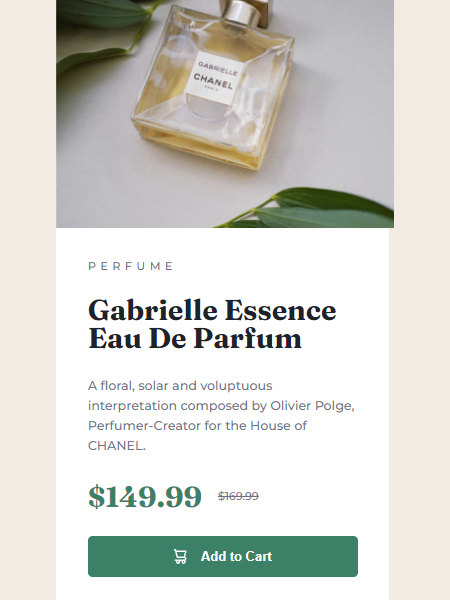

# Frontend Mentor - Product preview card component solution

This is a solution to the [Product preview card component challenge on Frontend Mentor](https://www.frontendmentor.io/challenges/product-preview-card-component-GO7UmttRfa). Frontend Mentor challenges help you improve your coding skills by building realistic projects. 

## Table of contents

  - [The challenge](#the-challenge)
  - [Screenshot](#screenshot)
  - [Links](#links)
  - [Built with](#built-with)
  - [Continued development](#continued-development)
- [Author](#author)
### The challenge

Users should be able to:

- View the optimal layout depending on their device's screen size
- See hover and focus states for interactive elements

### Screenshot

### Links

- Solution URL: [Add solution URL here](https://your-solution-url.com)
- Live Site URL: [Add live site URL here](https://your-live-site-url.com)

### Built with

- Basic semantic HTML
- Basic CSS
- Flexbox

### Continued development

I think a good idea would be to create an image zoom area around the pointer. I can learn to apply it to the project, but because this project is still in the newbie category, I don't think it's necessary yet. In the future when I make more difficult projects, I will be able to use this effect.

## Author

- Frontend Mentor - [@pRicard0](https://www.frontendmentor.io/profile/pRicard0)

